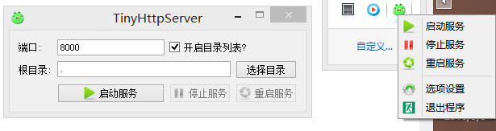
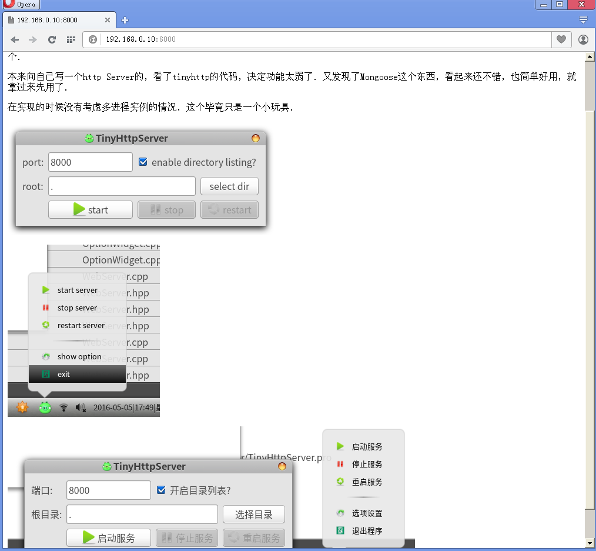
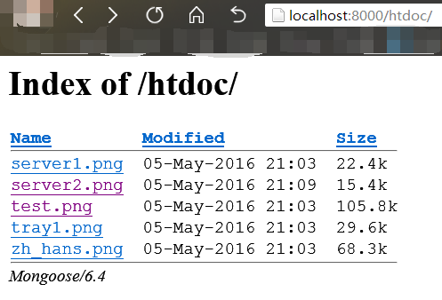

#Tiny Http Server
一个简单的跨平台Http服务器．服务器部分使用了Mongoose的代码，界面是使用QT开发的．
开发为了在临时需要使用一个http服务器来做发布代码文档的时候，不用去安装apache等大块头。又因为网上的一些迷你型的webserver又多是只支持windowns的，所以干脆自己做一个。

本来向自己写一个http Server的，看了tinyhttp的代码，觉得功能太弱了。结果又发现了Mongoose这个东西，看起来还不错，也简单好用，就拿过来先用了。

在实现的时候没有考虑多进程实例的情况，也没有对Mongoose进行错误处理，所有这个不适合严谨的场合使用。

二进制文件下载地址如下：

[windows 64bit:TinyHttpServer.exe.7z](http://git.oschina.net/oloroso/TinyHttpServer/blob/master/binary/TinyHttpServer.exe.7z)

[linux 64bit:TinyHttpServer](http://git.oschina.net/oloroso/TinyHttpServer/blob/master/binary/TinyHttpServer)

[中文语言包:zh_hans.qm](http://git.oschina.net/oloroso/TinyHttpServer/blob/master/binary/zh_hans.qm)

